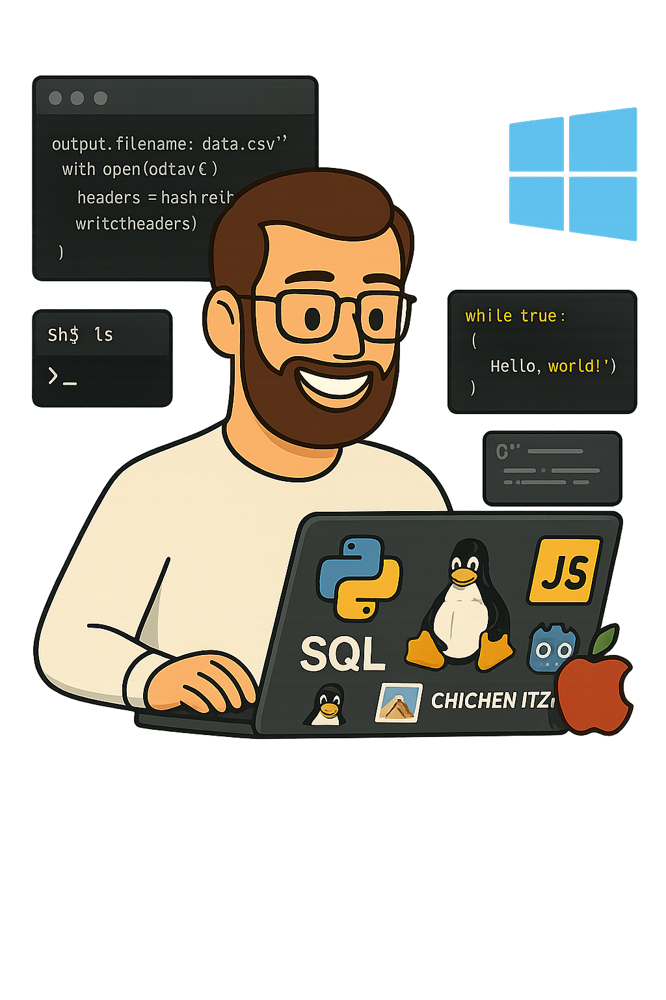

# 👋 Hi there! I'm Mitchell  
🛠️ **Developer specialized in Python, Shell Script, and PL/SQL**

---

### 🐍 Python & Automation  
Experienced in scripting for automation, data extraction, and handling CSV/Excel/JSON files.  
**Frameworks & libs:** `Tkinter`, `Selenium`, `Pandas`, `Requests`, `BeautifulSoup`, `Flask`

### 💻 Shell Scripting & Linux  
Skilled in system-level automation, cron jobs, and Unix/Linux shell tasks.

### 🧠 Oracle & PL/SQL  
Proficient in writing procedures, triggers, and batch jobs for Oracle databases.

### 🌐 JavaScript Stack  
Using `Node.js`, `Express`, and basic frontend/backend scripting.

### 📊 What I Build  
Tools that streamline business processes, reduce manual effort, and improve efficiency.

---

## 📫 Let’s Connect  
I help businesses automate tasks, process data, and build backend tools.

  

